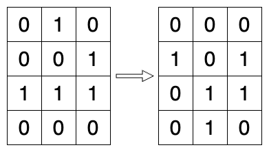
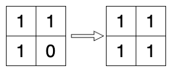
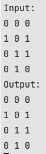

# Technical Interview

ExpertConnect | Sr. Software Engineer | Game of Life

---

## Problem Statement

According to [Wikipedia's article](https://en.wikipedia.org/wiki/Conway%27s_Game_of_Life): "The **Game of Life**, also known simply as Life, is a cellular automaton devised by the British mathematician John Horton Conway in 1970."

The board is made up of an `m x n` grid of cells, where each cell has an initial state: **live** (represented by a `1`) or **dead** (represented by a `0`). Each cell interacts with its [eight neighbors](https://en.wikipedia.org/wiki/Moore_neighborhood) (horizontal, vertical, diagonal) using the following four rules (taken from the above Wikipedia article):

* Any live cell with fewer than two live neighbors dies as if caused by under-population.
* Any live cell with two or three live neighbors lives on to the next generation.
* Any live cell with more than three live neighbors dies, as if by over-population.
* Any dead cell with exactly three live neighbors becomes a live cell, as if by reproduction.

The next state is created by applying the above rules simultaneously to every cell in the current state, where births and deaths occur simultaneously. Given the current state of the `m x n` grid `board`, return the next state.

### Samples

#### First

|I/O|Value|
|-|-|
|Input|`board = [[0,1,0],[0,0,1],[1,1,1],[0,0,0]]`|
|Output|`[[0,0,0],[1,0,1],[0,1,1],[0,1,0]]`|

#### Second

|I/O|Value|
|-|-|
|Input|`board = [[1,1],[1,0]]`|
|Output|`[[1,1],[1,1]]`|

### Constraints

* `m == board.length`
* `n == board[i].length`
* `1 <= m`, `n <= 25`
* `board[i][j]` is `0` or `1`

**Note:** The board needs to be updated simultaneously, you cannot update some cells first and then use their updated values to update other cells.

---

### Code Instruction

* Use `C#` as choice of language.
* Use `GameOfLife` project and/or `GameOfLife.sln`.
* The output should print on console in following format/pattern:

* This should work for all possible input values for `board` keeping all points mentioned in Constraints section in mind. Try running it for **atleast two** additional samples beyond the two mentioned above.
* Request is for the immediate "next state" processing, but you can extend the processing to include multiple "next states" and display all of them.
